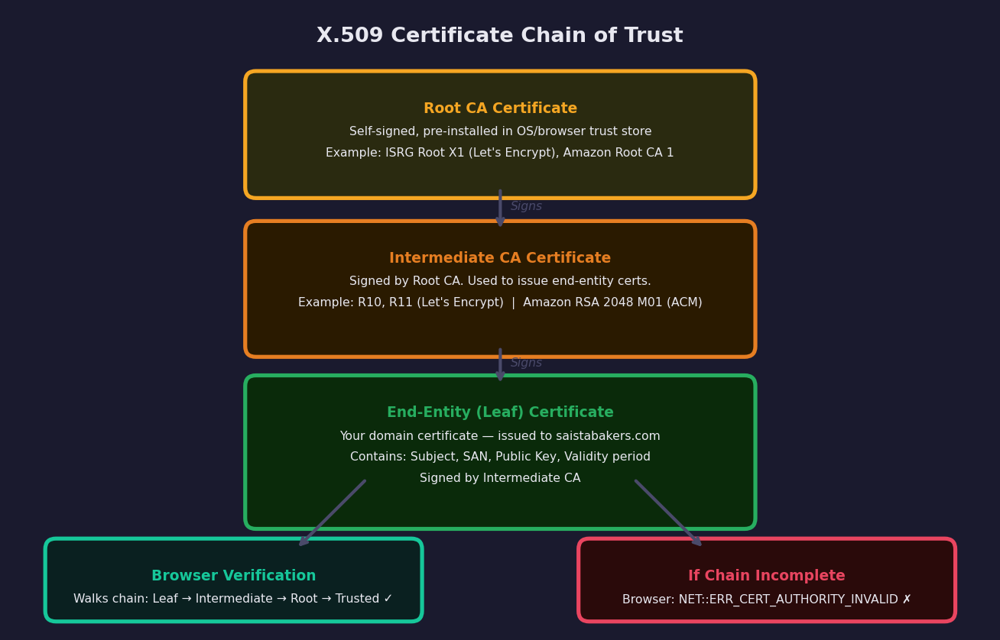
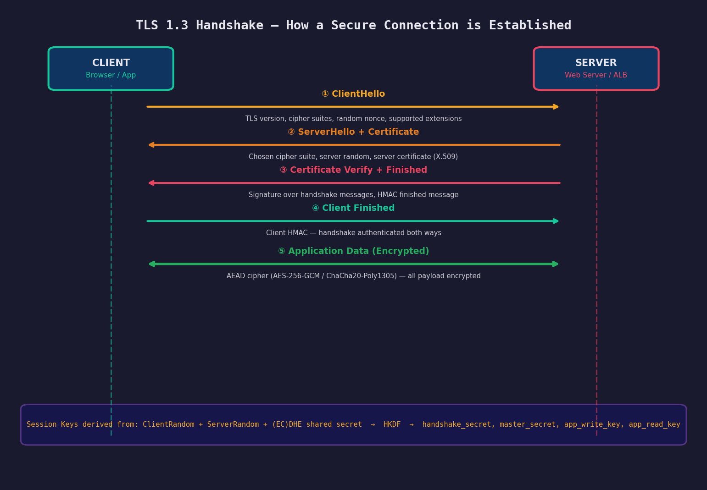
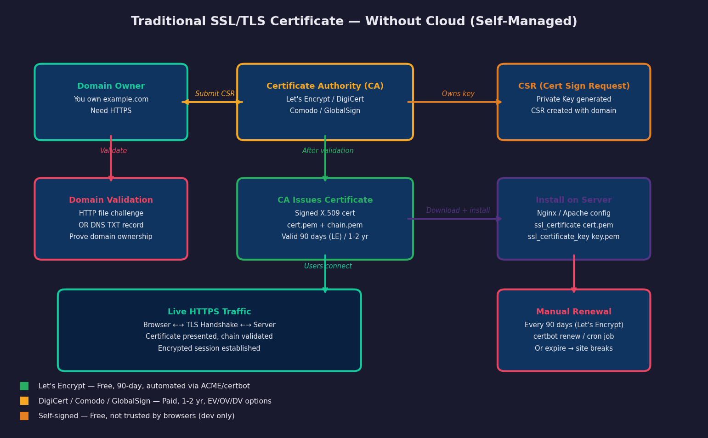
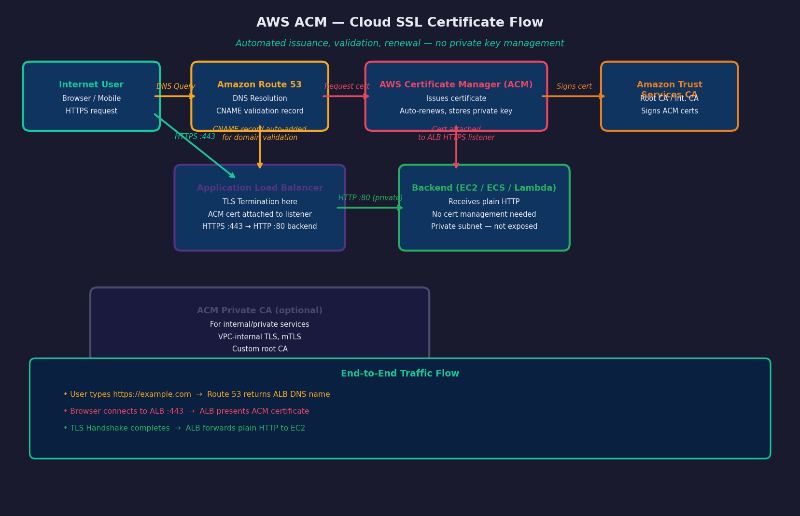
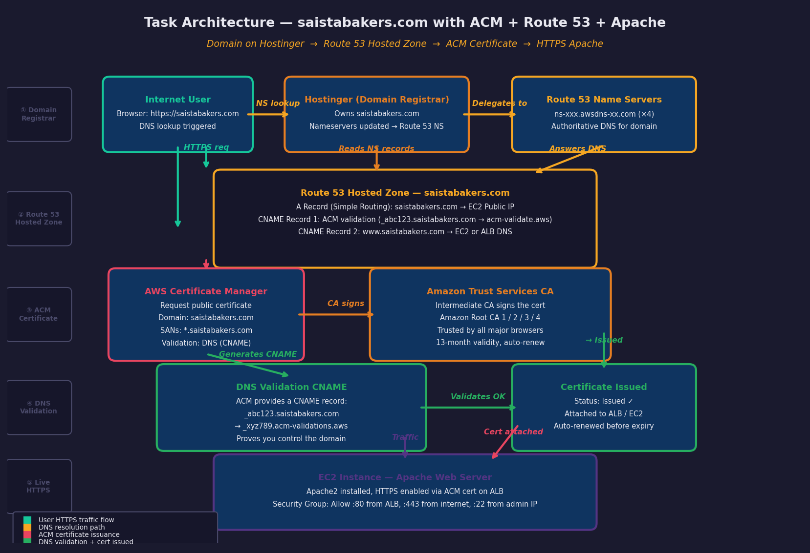

# AWS Certificate Manager (ACM) — Complete Case Study Documentation

> **Topics:** TLS/SSL Fundamentals · Certificate Providers · ACM Deep Dive · Hands-On Task

---

## Table of Contents

1. [PART 1 — SSL / TLS Fundamentals](#part-1--ssl--tls-fundamentals)
2. [What is SSL and TLS?](#what-is-ssl-and-tls)
3. [Certificate Providers and Certificate Types](#certificate-providers-and-certificate-types)
4. [TLS Handshake](#tls-handshake--how-a-secure-connection-is-established)
5. [TLS Termination at the Load Balancer](#tls-termination-at-the-load-balancer)
6. [PART 2 — AWS Certificate Manager (ACM)](#part-2--aws-certificate-manager-acm)
7. [ACM Core Components](#acm-core-components)
8. [PART 3 — Hands-On Task](#part-3--hands-on-task)
9. [Key Takeaways](#key-takeaways)

---

## PART 1 — SSL / TLS Fundamentals

# What is SSL and TLS?

Every time you see the padlock icon in a browser, **TLS (Transport Layer Security)** is silently protecting your connection. It ensures three things:

- **Confidentiality** — data is encrypted so no one in the middle can read it
- **Integrity** — data cannot be modified in transit without detection
- **Authentication** — you are talking to the real server, not an impersonator

**SSL (Secure Sockets Layer)** was the original protocol created by Netscape in 1994. All versions of SSL are now deprecated and considered insecure. **TLS** is its successor, first standardized in 1999, and is what the entire internet uses today. Despite this, the industry still commonly uses "SSL" as a colloquial term for what is technically TLS.

## SSL/TLS Version History

| Version | Year | Status | Notes |
| --- | --- | --- | --- |
| SSL 1.0 | 1994 | Never released | Internal Netscape draft — serious security flaws found |
| SSL 2.0 | 1995 | Deprecated (RFC 6176) | First public release — broken, MITM vulnerable |
| SSL 3.0 | 1996 | Deprecated (RFC 7568) | POODLE attack — do not use |
| TLS 1.0 | 1999 | Deprecated (2021) | Upgrade of SSL 3.0 — BEAST attack vulnerability |
| TLS 1.1 | 2006 | Deprecated (2021) | Minor fixes — still not recommended |
| TLS 1.2 | 2008 | Widely supported | Still secure with correct configuration |
| **TLS 1.3** | **2018** | **Current standard** | **Faster, simpler, more secure — use this** |

> Modern AWS services (ALB, CloudFront, ACM) support TLS 1.2 and TLS 1.3. TLS 1.3 reduces handshake latency and removes insecure cipher suites entirely.

## What is an X.509 Certificate?

An **X.509 certificate** is the standard format for SSL/TLS certificates. It is a digital document that binds a public key to an identity (domain name). It is signed by a Certificate Authority (CA) to prove its authenticity.

A certificate contains:

| Field | Example | Purpose |
| --- | --- | --- |
| **Subject** | CN=saistabakers.com, O=Sais Bakers | Who the cert belongs to |
| **SAN (Subject Alt Name)** | DNS:saistabakers.com, DNS:www.saistabakers.com | All domains covered by this cert |
| **Issuer** | Amazon RSA 2048 M01 | Which CA signed this cert |
| **Public Key** | RSA 2048-bit or EC P-256 | Used in TLS handshake key exchange |
| **Validity Period** | Not Before / Not After dates | When the cert is valid |
| **Serial Number** | Unique hex string | CA's unique identifier for this cert |
| **Signature** | CA's cryptographic signature | Proves the CA verified and signed it |
| **Key Usage** | digitalSignature, keyEncipherment | What the cert can be used for |

## Certificate Chain of Trust

Certificates work in a **chain of trust**. Your browser comes pre-installed with a set of **Root CA certificates** (from companies like DigiCert, Comodo, Amazon, Let's Encrypt's ISRG). When your browser receives a certificate, it walks the chain from your domain's certificate up to a trusted root.



If any link in the chain is missing, self-signed, or expired, the browser shows **NET::ERR_CERT_AUTHORITY_INVALID** and warns users not to proceed.

---

# Certificate Providers and Certificate Types

## Certificate Validation Levels

| Type | Validation | Browser Shows | Best For | Typical Cost |
| --- | --- | --- | --- | --- |
| **DV — Domain Validated** | Prove domain ownership only (DNS or HTTP file) | Padlock | Blogs, personal sites, APIs | Free (Let's Encrypt) to $10/yr |
| **OV — Organization Validated** | Domain + company identity verified by CA | Padlock + org in cert details | Business websites | $50–$200/yr |
| **EV — Extended Validation** | Rigorous legal entity verification | Padlock (was green bar, now removed) | Banks, e-commerce, legal | $100–$500/yr |
| **Wildcard** | DV or OV, covers *.example.com | Padlock | Subdomains at scale | $70–$300/yr |
| **Multi-Domain (SAN)** | Multiple domains on one cert | Padlock | Multiple products/brands | Varies |

## Major Certificate Providers

| Provider | Cost | Validity | Automation | Notes |
| --- | --- | --- | --- | --- |
| **Let's Encrypt** | Free | 90 days | ACME protocol / certbot | Largest CA by volume. Non-profit. No EV/OV. |
| **AWS ACM (Public)** | Free | 13 months (auto-renew) | Fully automated | Only for AWS services (ALB, CloudFront, API GW) |
| **DigiCert** | $175–$500+/yr | 1–2 years | Partial | Premium CA. EV, OV, DV. Enterprise SLAs. |
| **Comodo / Sectigo** | $70–$300/yr | 1–2 years | Partial | Wide browser support. Wildcard & multi-domain. |
| **GlobalSign** | $150–$400+/yr | 1–2 years | API available | Enterprise, IoT, DevOps focus. |
| **ZeroSSL** | Free / Paid | 90 days (free) | ACME support | Let's Encrypt alternative. REST API. |
| **Google Trust Services** | Free (via GCP) | 90 days | ACME | For Google Cloud users. |
| **Self-Signed** | Free | Any | Manual | Development only — not trusted by browsers. |

## How to Get an SSL Certificate — Let's Encrypt (Without Cloud)

Let's Encrypt is the most widely used free CA. It uses the **ACME protocol** (Automated Certificate Management Environment, RFC 8555) to automate domain validation and certificate issuance. The tool **certbot** handles this automatically.

```text
# Ubuntu/Debian — Install certbot
sudo apt update
sudo apt install certbot python3-certbot-apache -y

# Obtain certificate and auto-configure Apache
sudo certbot --apache -d example.com -d www.example.com

# Certbot will:
#  1. Create a temp file at /.well-known/acme-challenge/<token>
#  2. Let's Encrypt CA fetches that URL to verify domain ownership
#  3. CA issues certificate, certbot installs it in Apache
#  4. Adds cron job / systemd timer for auto-renewal every 60 days

# DNS validation (when no port 80 access)
sudo certbot certonly --manual --preferred-challenges dns -d example.com
# Certbot gives you a TXT record to add to your DNS provider

# Test renewal
sudo certbot renew --dry-run

# Certificate files stored at:
/etc/letsencrypt/live/example.com/fullchain.pem   # cert + chain
/etc/letsencrypt/live/example.com/privkey.pem     # private key
```

## How to Get an SSL Certificate — Manual / Paid CA

**Step 1: Generate Private Key + CSR on your server**

The private key never leaves your server. The CSR (Certificate Signing Request) contains your public key and domain info and is sent to the CA.

**Step 2: Submit CSR to CA (DigiCert, Comodo, etc.)**

**Step 3: Complete Domain Validation (DV) or Organization Validation (OV/EV)**

For DV: add a CNAME/TXT DNS record or upload a file to your web server. For OV/EV: the CA calls your company and verifies legal documents.

**Step 4: Download Certificate Files from CA**

You receive: certificate.crt (your cert), ca-bundle.crt (intermediate chain), and your existing private key.

**Step 5: Install Certificate on Server**

```text
# Step 1 — Generate private key and CSR
openssl genrsa -out private.key 2048
openssl req -new -key private.key -out domain.csr \
  -subj "/C=IN/ST=Maharashtra/L=Mumbai/O=Sais Bakers/CN=saistabakers.com"

# View CSR content
openssl req -text -noout -in domain.csr

# Step 5 — Install on Nginx
ssl_certificate     /etc/ssl/certs/certificate.crt;
ssl_certificate_key /etc/ssl/private/private.key;
ssl_trusted_certificate /etc/ssl/certs/ca-bundle.crt;

# Install on Apache
SSLCertificateFile    /etc/ssl/certs/certificate.crt
SSLCertificateKeyFile /etc/ssl/private/private.key
SSLCACertificateFile  /etc/ssl/certs/ca-bundle.crt
```

---

# TLS Handshake — How a Secure Connection is Established

Before any application data is exchanged, the **TLS handshake** establishes a shared secret between client and server, authenticates the server's identity via its certificate, and negotiates the encryption algorithms to use.



## TLS 1.3 Handshake Step by Step

| Step | Message | Who Sends | What It Contains |
| --- | --- | --- | --- |
| 1 | **ClientHello** | Client → Server | Supported TLS versions, cipher suites, client random nonce, key_share (EC public key) |
| 2 | **ServerHello** | Server → Client | Chosen cipher suite, server random nonce, server key_share, session ID |
| 3 | **EncryptedExtensions** | Server → Client | Additional negotiated parameters (ALPN, SNI confirmation) |
| 4 | **Certificate** | Server → Client | Server's X.509 cert chain (leaf + intermediate CA) |
| 5 | **CertificateVerify** | Server → Client | Digital signature over handshake transcript proving server holds the private key |
| 6 | **Finished** | Server → Client | HMAC over entire handshake — proves integrity of negotiation |
| 7 | **Finished** | Client → Server | Client HMAC — confirms both sides derived the same keys |
| 8 | **Application Data** | Both (encrypted) | All payload encrypted with AEAD cipher (AES-256-GCM or ChaCha20-Poly1305) |

### Key Derivation (HKDF)

TLS 1.3 uses **HKDF (HMAC-based Key Derivation Function)** to derive multiple keys from the shared secret produced by the (EC)DHE key exchange:

```text
Inputs:
  Client Random  +  Server Random  +  (EC)DHE shared secret

HKDF derives:
  handshake_traffic_secret  → encrypts the handshake itself
  client_application_traffic_secret  → client write key + IV
  server_application_traffic_secret  → server write key + IV
  exporter_master_secret    → for applications needing keying material

Session keys are EPHEMERAL — new keys for every session
Perfect Forward Secrecy: past sessions cannot be decrypted even if private key is later compromised
```

## How Payload is Encrypted

TLS uses a combination of **asymmetric cryptography** (for key exchange) and **symmetric cryptography** (for bulk data encryption):

| Phase | Algorithm Type | Algorithm Used | Purpose |
| --- | --- | --- | --- |
| Key Exchange | Asymmetric | ECDHE (P-256, X25519) | Securely establish shared secret without transmitting it |
| Authentication | Asymmetric | RSA-2048 / ECDSA P-256 | Server proves identity using private key signature |
| Key Derivation | Symmetric | HKDF-SHA256 / HKDF-SHA384 | Derive session keys from shared secret |
| Data Encryption | Symmetric | AES-256-GCM / ChaCha20-Poly1305 | Encrypt all application data (fast, AEAD) |
| Integrity | Built into AEAD | Poly1305 / GCM tag | Detect any tampering with encrypted data |

> AEAD = Authenticated Encryption with Associated Data. It simultaneously encrypts the payload AND produces an authentication tag. If any byte is altered in transit, decryption fails and the connection is dropped immediately.

---

# TLS Termination at the Load Balancer

**TLS Termination** means the Load Balancer decrypts incoming HTTPS traffic and forwards plain HTTP to the backend servers. This is the standard pattern in AWS and most cloud architectures.

## Why Terminate TLS at the Load Balancer?

| Reason | Explanation |
| --- | --- |
| **Certificate in one place** | Single cert on the ALB — backends need no cert management |
| **Offload CPU cost** | TLS crypto is CPU-intensive. ALB handles it, freeing EC2 for app logic |
| **Inspect HTTP headers** | ALB can route by path, host, header — only possible after decryption |
| **WAF integration** | AWS WAF inspects decrypted HTTP traffic for SQL injection, XSS, etc. |
| **Centralized renewal** | ACM auto-renews one cert instead of managing certs on every EC2 |
| **Scaling** | Add/remove EC2s without redistributing certificates |

```text
HTTPS Traffic Flow with TLS Termination:

Browser
  │
  │  HTTPS :443  (TLS encrypted)
  ▼
ALB  ←── ACM Certificate attached here
  │  TLS Handshake + Decryption happens at ALB
  │
  │  HTTP :80  (plain text — travels over private VPC network only)
  ▼
EC2 Instances  (no cert needed, receives plain HTTP)

Optional — End-to-End Encryption (E2E TLS):
Browser → HTTPS :443 → ALB → HTTPS :443 → EC2
(ALB re-encrypts to backend — used for strict compliance requirements)

Optional — mTLS (Mutual TLS):
Client presents its own cert → ALB validates client cert → Backend
(Used in zero-trust, B2B APIs, service mesh)
```

## Traditional SSL vs Cloud SSL — Flow Comparison



In the traditional model you generate a private key on your server, create a CSR, submit it to a CA, download the signed certificate, install it manually, configure your web server, and remember to renew it before it expires. The private key never leaves your server — but managing this across many servers becomes complex and error-prone.

---

## PART 2 — AWS Certificate Manager (ACM)

# What is AWS Certificate Manager?

**AWS Certificate Manager (ACM)** is a fully managed service that provisions, manages, and automatically renews SSL/TLS certificates for use with AWS services. ACM eliminates the manual work of certificate management — you never handle private keys, never manually renew, and certificates are free for use with supported AWS services.



## ACM Key Features

| Feature | Details |
| --- | --- |
| **Free for AWS services** | No charge for ACM public certificates. Only pay for ACM Private CA. |
| **Automatic renewal** | ACM renews certs at least 60 days before expiry — completely hands-free |
| **Private key security** | Private key stored in AWS HSMs (Hardware Security Modules) — you never see it |
| **Two validation methods** | DNS validation (recommended) or Email validation |
| **Wildcard support** | Single cert for *.example.com covers unlimited subdomains |
| **Multi-region** | CloudFront requires cert in us-east-1. ALB requires cert in same region. |
| **Transparency logging** | All issued certs logged to public Certificate Transparency logs |
| **ACM Private CA** | Create your own internal CA for private services, mTLS, IoT |

## ACM vs Self-Managed Certificate

| Aspect | ACM (Cloud) | Self-Managed (Let's Encrypt / DigiCert) |
| --- | --- | --- |
| Cost | Free (for AWS resources) | Free (LE) to $500+/yr (DigiCert EV) |
| Renewal | Fully automatic | Manual or cron job (can fail) |
| Private Key Access | Never exposed — stored in AWS HSM | You have full access to key |
| Installation | Click to attach to ALB/CloudFront | Manual server config (Nginx/Apache) |
| Works on non-AWS servers | No — AWS services only | Yes — any server |
| Wildcard | Yes | Yes |
| EV/OV certificates | No — DV only | Yes (paid CAs) |
| Private CA | ACM Private CA (paid) | Self-hosted (OpenSSL, CFSSL) |
| Validity | 13 months (auto-renewed) | 90 days (LE) or 1-2 years (paid) |

---

# ACM Core Components

### 1. Public Certificate

A free, domain-validated certificate issued by **Amazon Trust Services** (Amazon's own CA). Can only be attached to: **ALB, NLB, CloudFront, API Gateway, Elastic Beanstalk, AppSync, and other integrated AWS services**. Cannot be exported or installed on an EC2 directly.

### 2. Certificate Validation

ACM must verify you own the domain before issuing a certificate:

| Method | How It Works | Best For |
| --- | --- | --- |
| **DNS Validation (Recommended)** | ACM gives you a CNAME record to add to your DNS. ACM polls the record periodically. Auto-renews as long as the CNAME stays in DNS. | Route 53 users (one-click add), programmatic workflows |
| **Email Validation** | ACM emails the domain's WHOIS contacts (admin@, webmaster@, etc.). Someone must click the approval link. | Domains where you cannot modify DNS |

### 3. Amazon Trust Services (ATS)

**Amazon Trust Services** is Amazon's own Certificate Authority, launched in 2016. It operates the root CAs and intermediate CAs that sign all ACM-issued certificates.

| Root CA | Algorithm | Validity | Trusted Since |
| --- | --- | --- | --- |
| Amazon Root CA 1 | RSA 2048 | 2038 | 2016 — pre-installed in all major browsers/OS |
| Amazon Root CA 2 | RSA 4096 | 2040 | 2016 |
| Amazon Root CA 3 | EC P-256 | 2040 | 2016 |
| Amazon Root CA 4 | EC P-384 | 2040 | 2016 |
| Starfield Services Root CA G2 | RSA 2048 | 2037 | Cross-certified by older Starfield root for legacy devices |

ACM certificates are signed by an **Intermediate CA** (e.g. Amazon RSA 2048 M01, M02) which is in turn signed by Amazon Root CA 1. Browsers trust Amazon Root CA 1 by default, so ACM certs are trusted everywhere.

### 4. Automatic Renewal

ACM begins the renewal process at least **60 days before expiry** for DNS-validated certs. As long as the validation CNAME record remains in your DNS, renewal is fully automatic and zero-downtime — the new certificate is silently swapped in.

> For email-validated certs, someone must click the renewal email within 72 hours. This is why DNS validation is strongly recommended for production workloads.

### 5. ACM Private CA

**ACM Private CA** (previously AWS Private CA) lets you create and operate your own private Certificate Authority for issuing certificates to internal services:

- Private microservices communicating over mTLS inside a VPC
- IoT devices that need unique certificates
- Internal tools that need HTTPS without public CA validation
- Zero-trust architectures requiring client certificates

Pricing: $400/month per CA + $0.75 per certificate issued.

## ACM Supported AWS Services

| Service | Notes |
| --- | --- |
| **Application Load Balancer (ALB)** | Most common — HTTPS listener attaches ACM cert |
| **Network Load Balancer (NLB)** | TLS listener on port 443 |
| **CloudFront** | Certificate must be in us-east-1 (N. Virginia) region |
| **API Gateway** | Custom domain name with ACM cert |
| **Elastic Beanstalk** | HTTPS on load balancer |
| **AppSync** | Custom domain with ACM cert |
| **Cognito** | Custom domain for hosted UI |
| **Global Accelerator** | TLS termination at edge |

> ACM certificates CANNOT be directly installed on EC2 instances. If you need HTTPS directly on EC2 (without a load balancer), use Let's Encrypt or a paid CA.

## ACM Certificate Lifecycle Flow

```text
You request cert in ACM console
  │
  │ Enter domain: saistabakers.com + *.saistabakers.com
  │ Choose: DNS validation
  ▼
ACM generates CNAME record
  _abc123xyz.saistabakers.com → _xyz789abc.acm-validations.aws
  │
  │ You add this CNAME to Route 53 (or any DNS provider)
  ▼
ACM polls your DNS every few minutes
  │
  │ Sees CNAME record → Domain ownership confirmed
  ▼
Amazon Trust Services signs certificate
  │
  │ Status changes: Pending Validation → Issued
  ▼
You attach cert to ALB HTTPS listener
  │
  │ Select cert from ACM in ALB listener config
  ▼
HTTPS live on your domain
  │
  │ Auto-renewed at 60 days before expiry
  ▼
Renewal: ACM polls same CNAME → Re-issues → Zero downtime swap
```

---

## PART 3 — Hands-On Task

# Task — Enable HTTPS on saistabakers.com Using ACM + Route 53

## Task Overview

In this task, you already own the domain **saistabakers.com** purchased from **Hostinger**. The goal is to serve a secure HTTPS Apache website using AWS Route 53 for DNS and AWS ACM for the SSL certificate — without managing any certificate files manually.

| Component | Detail |
| --- | --- |
| Domain | saistabakers.com (purchased on Hostinger) |
| DNS Provider | Amazon Route 53 (Hosted Zone created, NS updated at Hostinger) |
| SSL Certificate | AWS ACM — DNS validated, free, auto-renewing |
| Validation | CNAME record added in Route 53 |
| Traffic | Simple Routing — A record → EC2 Public IP |
| Web Server | Apache2 on EC2 serving HTTPS (via ACM on ALB or directly) |
| Subdomain | www.saistabakers.com → same EC2 (additional CNAME in Route 53) |

## Task Architecture Diagram



## Complete Step-by-Step Guide

**Step 1: Create Route 53 Hosted Zone for saistabakers.com**

- Open AWS Console → Route 53 → Hosted Zones → **Create Hosted Zone**
- Domain name: `saistabakers.com`
- Type: **Public Hosted Zone**
- Click Create

Route 53 auto-creates NS and SOA records. Note the 4 NS records:

```text
ns-xxx.awsdns-xx.com
ns-yyy.awsdns-yy.net
ns-zzz.awsdns-zz.org
ns-www.awsdns-ww.co.uk
```

**Step 2: Update Nameservers at Hostinger**

- Log in to Hostinger → Domains → saistabakers.com → **DNS / Nameservers**
- Change nameservers from Hostinger default to **Custom Nameservers**
- Enter all 4 Route 53 NS records
- Save — DNS propagation takes a few minutes to 48 hours

> Once Hostinger nameservers are updated, all DNS for saistabakers.com is controlled by Route 53. Any records you add in Route 53 are now live on the internet.

**Step 3: Launch EC2 Instance and Install Apache2**

| Setting | Value |
| --- | --- |
| AMI | Ubuntu 22.04 LTS (or Amazon Linux 2023) |
| Instance Type | t2.micro (Free Tier) |
| Key Pair | Create or select existing |
| Public IP | Enable auto-assign |
| Security Group | Allow SSH :22 (your IP), HTTP :80 (anywhere), HTTPS :443 (anywhere) |

Connect and install Apache2:

```text
ssh -i your-key.pem ubuntu@<EC2-PUBLIC-IP>

sudo apt update -y
sudo apt install apache2 -y
sudo systemctl start apache2
sudo systemctl enable apache2

# Create a simple webpage
sudo bash -c 'cat > /var/www/html/index.html << EOF
<!DOCTYPE html>
<html>
<head><title>Sais Bakers</title></head>
<body>
<h1>Welcome to Sais Bakers!</h1>
<p>Secured with AWS ACM + Route 53</p>
</body>
</html>
EOF'

# Verify Apache is running
sudo systemctl status apache2
curl http://localhost
```

Note your EC2 public IP — you'll need it for the DNS A record.

**Step 4: Request SSL Certificate in AWS ACM**

- Open AWS Console → **Certificate Manager (ACM)**
- Click **Request a certificate** → **Request a public certificate**
- Add domain names:

```text
saistabakers.com
*.saistabakers.com
```

  - Validation method: **DNS validation** (Recommended)
  - Key algorithm: RSA 2048
- Click **Request**

The certificate status shows **Pending validation**. ACM is waiting for you to prove domain ownership by adding a CNAME record to your DNS.

**Step 5: Add ACM CNAME Validation Record to Route 53**

In the ACM certificate details page, you will see a CNAME record that ACM generated:

```text
Record Name:  _abc123xyz.saistabakers.com
Record Type:  CNAME
Record Value: _xyz789abc.acm-validations.aws
```

Add this to Route 53:

- Go to Route 53 → Hosted Zones → saistabakers.com
- Click **Create Record**
- Record name: `_abc123xyz` (just the part before .saistabakers.com)
- Record type: **CNAME**
- Value: `_xyz789abc.acm-validations.aws`
- TTL: 300
- Click **Create records**

Shortcut: If your domain is already in Route 53, ACM offers a **"Create records in Route 53"** button that adds the CNAME automatically in one click.

Wait 2–5 minutes. ACM detects the CNAME and the status changes to **Issued**.

**Step 6: Add Subdomain CNAME for www.saistabakers.com**

Add a second DNS record in Route 53 to handle the `www` subdomain:

```text
Record Name:  www
Record Type:  CNAME
Record Value: saistabakers.com
TTL:          300
```

This makes `www.saistabakers.com` resolve to the same destination as `saistabakers.com`. The ACM wildcard cert (`*.saistabakers.com`) already covers the www subdomain.

**Step 7: Create A Record with Simple Routing — Point Domain to EC2**

- Route 53 → Hosted Zones → saistabakers.com → **Create Record**

| Field | Value |
| --- | --- |
| Record Name | (leave blank — for root domain saistabakers.com) |
| Record Type | A — Routes traffic to IPv4 address |
| Routing Policy | Simple routing |
| Value | EC2 Public IP (e.g. 54.12.34.56) |
| TTL | 300 |

Click **Create records**.

Your Route 53 hosted zone now has these records:

```text
saistabakers.com              A      54.12.34.56           (→ EC2)
www.saistabakers.com          CNAME  saistabakers.com      (→ root)
_abc123.saistabakers.com      CNAME  _xyz789.acm-valid...  (ACM validation)
saistabakers.com              NS     ns-xxx.awsdns-xx.com  (auto-created)
saistabakers.com              SOA    (auto-created)
```

**Step 8: Attach ACM Certificate to ALB (for full HTTPS end-to-end)**

Since ACM certs cannot be directly installed on EC2, you need an **Application Load Balancer** to terminate TLS and forward HTTP to EC2. If you want HTTPS directly to EC2 without an ALB, use Let's Encrypt certbot instead (see Step 8B below).

ALB path (Recommended for production):

- Create ALB in same region as your EC2
- Add **HTTPS :443 listener** → select your ACM certificate
- Add **HTTP :80 listener** → redirect to HTTPS (optional)
- Create Target Group → add EC2 → attach to ALB
- Update Route 53 A record → change value to ALB DNS name (use **Alias record**)

```text
# Route 53 after ALB setup:
saistabakers.com   A (Alias)  →  my-alb-1234.us-east-1.elb.amazonaws.com

# Security Group: EC2
Allow HTTP :80 from ALB Security Group (not 0.0.0.0/0)

# Security Group: ALB
Allow HTTPS :443 from 0.0.0.0/0
Allow HTTP  :80  from 0.0.0.0/0
```

Alternative — Step 8B: certbot directly on EC2 (no ALB needed):

```text
# Install certbot on EC2
sudo apt install certbot python3-certbot-apache -y

# Get certificate (requires port 80 open and DNS already pointing to EC2)
sudo certbot --apache -d saistabakers.com -d www.saistabakers.com

# certbot auto-configures Apache with HTTPS and sets up auto-renewal
sudo systemctl reload apache2

# Verify HTTPS
curl -I https://saistabakers.com
```

**Step 9: Validate the Complete Setup**

```text
# Check DNS propagation
nslookup saistabakers.com
dig saistabakers.com A
dig www.saistabakers.com CNAME

# Check certificate details
openssl s_client -connect saistabakers.com:443 -servername saistabakers.com

# Check certificate info
curl -vI https://saistabakers.com 2>&1 | grep -E "SSL|certificate|issuer"

# Expected output:
* Server certificate:
*  subject: CN=saistabakers.com
*  start date: ...
*  expire date: ...
*  issuer: C=US, O=Amazon, CN=Amazon RSA 2048 M01
*  SSL certificate verify ok.

# Check browser:
https://saistabakers.com   →  Padlock visible
https://www.saistabakers.com  →  Same page
```

## DNS Records Summary

| Record Name | Type | Value | Purpose |
| --- | --- | --- | --- |
| saistabakers.com | A | 54.12.34.56 (or ALB Alias) | Simple routing → EC2 / ALB |
| www.saistabakers.com | CNAME | saistabakers.com | www subdomain → root domain |
| _abc123.saistabakers.com | CNAME | _xyz789.acm-validations.aws | ACM DNS validation |
| saistabakers.com | NS | 4× awsdns NS records | Route 53 nameservers (auto) |
| saistabakers.com | SOA | ns-xxx.awsdns-xx.com | Zone authority record (auto) |

## Common Errors and Fixes

| Error | Cause | Fix |
| --- | --- | --- |
| ACM cert stuck in Pending Validation | CNAME not yet added or DNS not propagated | Verify CNAME in Route 53. Wait 5 min. Check with: dig _abc123.saistabakers.com CNAME |
| Site shows insecure / padlock missing | HTTP still served or cert not attached | Check ALB HTTPS listener. Redirect HTTP→HTTPS. Verify ACM cert status is Issued. |
| nslookup returns Hostinger IPs | Hostinger nameservers not yet updated or propagation pending | Check Hostinger panel. NS records must match Route 53 NS. Wait up to 48 hours. |
| ERR_CERT_NAME_INVALID | Cert domain does not match the URL | Cert was issued for saistabakers.com but accessed via IP or different domain. |
| Apache serves HTTP not HTTPS on EC2 directly | No cert on EC2 — ACM only works with ALB | Use ALB with ACM cert, or use certbot on EC2 directly. |

---

# Key Takeaways

- **TLS** replaced SSL — TLS 1.3 is the current standard. Never use SSL 2.0/3.0 or TLS 1.0/1.1.
- **X.509 certificates** bind a domain to a public key and are signed by a trusted CA.
- **Certificate chain of trust**: Root CA → Intermediate CA → Leaf certificate.
- **TLS Handshake** authenticates the server, negotiates cipher, and derives session keys — all before data flows.
- **AEAD encryption** (AES-256-GCM, ChaCha20-Poly1305) ensures both confidentiality and integrity of payload.
- **TLS Termination at ALB** offloads certificate management and enables HTTP-level routing and WAF inspection.
- **ACM** is free, fully managed, and auto-renews. Best choice for all AWS-hosted applications.
- **Amazon Trust Services** is Amazon's own CA — its root certs are trusted by all major browsers.
- **DNS Validation** is preferred over Email Validation — it enables fully automatic renewal.
- **ACM certs cannot be installed on EC2 directly** — use ALB, or use certbot/Let's Encrypt for direct EC2 HTTPS.
- **Wildcard cert** (`*.saistabakers.com`) covers all subdomains with one certificate.

---

> *HTTPS is not optional — ACM makes it effortless. Secure every endpoint, automate every renewal.*
